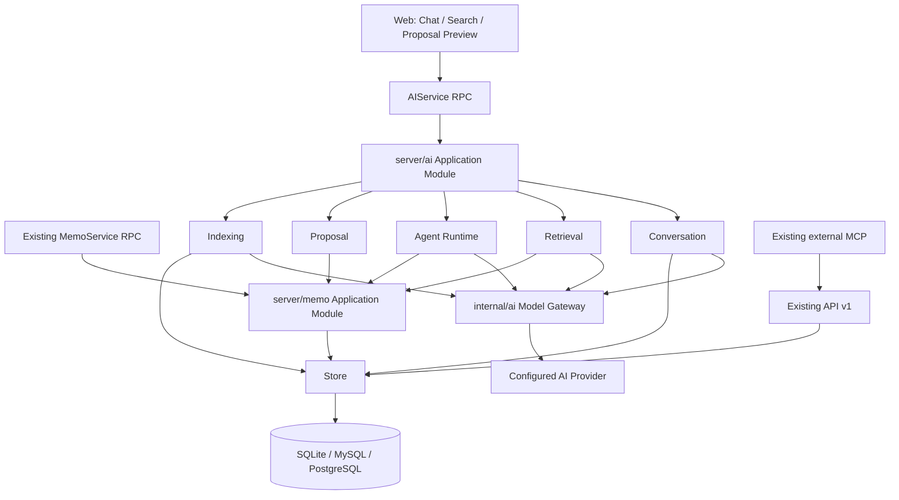
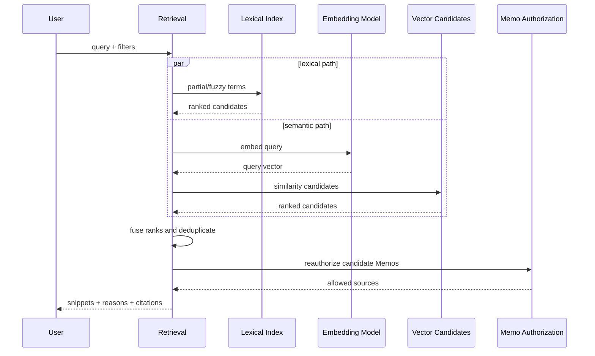
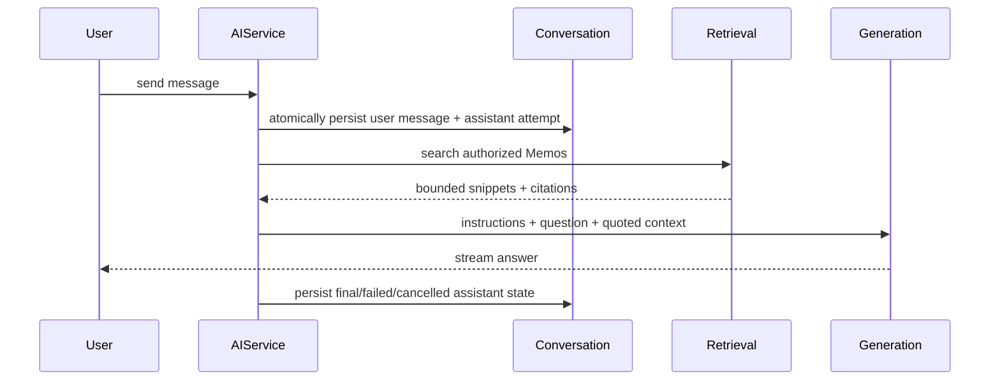

# AI-Native Memos Architecture

- **Status:** Approved design; implementation not started
- **Approved:** 2026-07-18
- **Last reviewed:** 2026-07-18
- **Canonical scope:** In-product Chat, hybrid search, and confirmation-gated Agent creation/update

This document owns subsystem architecture and cross-module invariants. Detailed data lifecycle rules live in
[`docs/DATA.md`](../DATA.md), security and provider-egress rules in [`docs/SECURITY.md`](../SECURITY.md), user-visible behavior in the
[product specification](../product-specs/ai-native-notes.md), and delivery gates in the [roadmap](../ROADMAP.md) and
[execution plans](../PLANS.md).

## 1. Decision Summary

Memos will add an in-process AI application module. It supports Chat and Agent experiences that can read and search authorized Memos, then propose creation or updates for explicit user confirmation.

The baseline remains one Memos process plus SQLite, MySQL, or PostgreSQL. Embeddings are stored as rebuildable derived data in the configured database and compared in the Go process. No external vector database is required.

The supported baseline is an individual or small trusted-group deployment. Retrieval work must be bounded by explicit scan, memory, candidate,
context, and wall-clock budgets. Stage 2 and Stage 3 record the benchmarked support envelope for all three databases before their go/no-go gates;
exceeding that envelope produces an explicit degraded result instead of unbounded work.

The initial searchable corpus is `NORMAL`, top-level Memos. An H1-derived title, extracted tags, and a plain-text projection of Markdown content are
searchable. Archived Memos, comments, attachment bodies, and Chat history are excluded. Changing this corpus requires a new projection version and a
rebuild.

Assigning an external generation or embedding capability is an explicit administrator action after the settings UI discloses what leaves Memos.
Generation sends only request-selected context. Embedding incrementally sends every eligible corpus chunk to the configured provider, so it must not
be described as merely sending occasional search snippets. All users can see whether external AI processing is enabled. Per-user opt-in is outside the
first release.

The existing `server/router/mcp/` module is outside this initiative and must not change. In-product AI does not call MCP, and AI provider credentials do not authenticate MCP requests.

## 2. Goals

- Provide a private, persistent Chat workspace grounded in authorized Memos.
- Search by partial keyword, spelling variation, tags, title, content, and semantic meaning.
- Return traceable Memo citations with search and Chat answers.
- Allow an Agent to propose creating or updating a Memo.
- Require explicit confirmation before any Agent-originated write.
- Work without extra infrastructure across all supported databases.
- Degrade cleanly when providers or semantic indexing are unavailable.

## 3. Non-Goals

- Changing the external MCP protocol, tools, authentication, or implementation.
- Giving the in-product Agent delete or unattended bulk-write capabilities.
- User-level provider credentials in the first release.
- Requiring a vector database, GPU, or additional deployment unit.
- Indexing Chat history as Memos.
- Exposing hidden reasoning or a Git-style patch review UI.
- Extracting text from every attachment type in the first release.

## 4. Architecture



### 4.1 Application Module

`server/ai` owns the authenticated use cases:

- start and continue a conversation;
- search authorized Memos;
- construct bounded model context;
- orchestrate model-requested read/search capabilities;
- create a proposal;
- apply or dismiss a proposal;
- report index status and request a rebuild.

Its external interface stays small. Provider retries, context budgets, retrieval fusion, message lifecycle, tool validation, and concurrency checks remain implementation details.

Every request accepts an explicit authenticated principal and `context.Context`. `server/ai` never recovers identity from global state, calls an HTTP
handler in-process, or reads raw Store records to bypass Memo policy.

### 4.2 Model Gateway

`internal/ai` evolves from transcription transports into provider-neutral capabilities:

- text generation and streaming;
- structured tool requests as a separately reported model capability;
- embedding, including batch input and vector dimensions;
- existing transcription behavior.

OpenAI-compatible and Gemini adapters satisfy these interfaces. Callers select a configured capability, not a concrete provider SDK. A provider type
does not prove that an arbitrary model supports streaming, embeddings, or structured tools: readiness tests report capabilities separately. Chat may
use text generation without tool support; the Agent remains disabled unless structured tool requests pass validation. HTTP clients, timeouts, and
limits are injected for tests.

### 4.3 Shared Memo Application Module

Current Memo authorization, validation, Markdown payload construction, and post-write side effects live in API v1 handlers. Before AI code depends on
them, they move behind a deep `server/memo` module used by both existing Memo RPC handlers and `server/ai`. Its interface owns authorized reads,
searchable-source enumeration, normal Memo commands, and transactional application of a confirmed proposal. Store remains raw persistence and is not
an authorization interface.

The module preserves content limits, visibility and archived-state rules, Markdown payload extraction, and the existing webhook, notification, and SSE
semantics. Stage 2 extracts the read/authorization path; Stage 4 extracts the mutation path needed for proposal application. Tests exercise the same
module interface used by both callers.

### 4.4 Agent Capability Set

The Agent-facing internal seam exposes only:

- `ReadMemo`
- `SearchMemos`
- `PrepareCreateProposal`
- `PrepareUpdateProposal`

Names illustrate behavior rather than prescribe Go signatures. The final interface should minimize methods and parameter knowledge while preserving current-user identity and request cancellation.

`ApplyProposal` is deliberately absent. Applying is a user command accepted only from the authenticated confirmation RPC; the model cannot invoke it as
a tool, even if model output claims that the user confirmed.

## 5. Capability Configuration

The instance AI setting remains a provider credential pool plus feature assignments:

```text
InstanceAISetting
├── providers[] { id, type, endpoint, api_key, allow_private_network }
├── transcription { provider_id, model, language, prompt }
├── generation    { provider_id, model }
└── embedding     { provider_id, model, dimensions? }
```

Chat and Agent share `generation` initially. Separate generation profiles require a future design only after a real routing need appears.

The embedding configuration has a stable fingerprint derived from provider type, sanitized endpoint identity, model, resolved dimensions, corpus
projection version, chunker version, normalization version, and vector-encoding version. Endpoint identity never includes credentials or secret query
values. Vectors with another fingerprint or dimension are incompatible and excluded from active semantic retrieval.

Provider settings are instance-managed. Ordinary users may see whether AI capabilities are available, but never receive provider keys.

All provider calls, including connectivity tests, use one hardened transport policy. Endpoints must use HTTP or HTTPS and may not contain userinfo or
fragments. Redirects and resolved destinations are revalidated. Loopback, link-local, and private-network destinations are denied by default and require
an explicit administrator opt-in so local self-hosted models remain possible without silently widening the SSRF boundary.

The new opt-in defaults to false. A previously persisted custom endpoint is treated as a prior administrator decision and migrated to preserve current
transcription behavior, while the UI makes the widened network scope visible. New or edited providers and newly supplied deployment configuration must
set the opt-in explicitly.

## 6. Data Model

This section fixes the architectural record types and invariants. [`docs/DATA.md`](../DATA.md) owns detailed field, retention, encoding, migration, and
cleanup contracts.

### 6.1 Conversation and Message

`ai_conversation` stores owner, title, and timestamps. First-release conversations always persist until their owner deletes them; an ephemeral-history
preference is deferred until its retention and failure semantics are designed. `ai_message` stores conversation, role, visible content, status, model
metadata, usage, authorized Memo citations, a client request ID, and an attempt relationship.

Message states distinguish streaming, complete, failed, and cancelled responses. Hidden provider reasoning is neither requested as a product feature nor stored.

### 6.2 Proposal

`ai_proposal` stores:

- owner and optional conversation;
- `CREATE` or `UPDATE` kind;
- optional target Memo;
- complete proposed fields within the first-release mutation scope;
- target Memo base revision for updates;
- concise affected-area metadata;
- `PENDING`, `APPLIED`, `DISMISSED`, or `EXPIRED` state;
- timestamps and applied Memo reference.

Create proposals contain content and visibility. Update proposals change content only; attachments, relations, location, timestamps, state, pinning, and
bulk operations require later designs. Extracted tags and title may still change because they derive from content.

The persisted proposal is the authorization and concurrency unit. Model output alone is never a write instruction. Every user-visible Memo mutation
increments a monotonic Memo revision so an update proposal can use database compare-and-swap rather than an update timestamp or a read-then-write
content check.

### 6.3 Lexical Search Document

`ai_search_document` is provider-independent derived data. It stores Memo identity and revision, source content hash, corpus-projection and
normalization versions, normalized title/tags/body text, and the mapping needed to turn projected matches back into source spans. Stage 2 builds these
documents locally, so exact/partial/fuzzy retrieval does not require generation or embedding configuration.

### 6.4 Embedding Generation and Chunk

`ai_index_generation` records a fingerprint, the configured provider reference and non-secret model identity, `BUILDING`, `ACTIVE`, or `RETIRED`
state, progress counters, and timestamps. At most one generation is active. A generation is callable only while the current provider pool still has a
provider whose type and sanitized endpoint identity match it. `ai_index_chunk` stores generation, Memo identity and revision, chunk ordinal, a
search-document projection span and source-span mapping, vector bytes, dimensions, and indexing timestamp. It does not duplicate the complete search
document.

Search documents, generations, and index chunks are derived. They can be deleted without deleting a Memo, and every row can be reconstructed from
source data and current configuration.

Vectors use finite, L2-normalized IEEE 754 float32 values in documented little-endian BLOB/BYTEA encoding. Dimension and byte-length mismatches reject
the batch. The baseline similarity implementation runs in Go over database rows read in bounded batches. A future high-scale adapter may replace this
implementation behind the retrieval seam without changing Chat or Agent callers.

## 7. Retrieval

### 7.1 Query Pipeline



Lexical retrieval covers exact tokens, substrings, normalized title/tag/body text, and typo-tolerant similarity. Semantic retrieval compares the query
embedding only with chunks in the `ACTIVE` generation. Ranking fusion combines ordinal ranks rather than assuming lexical and cosine scores share a
scale.

Structured filters such as tags, time, visibility, creator, and Memo properties narrow candidates. Existing CEL filters remain available to current API callers; the AI retrieval interface translates product search intent without asking the model to manufacture raw SQL.

Each query has hard limits for normalized query size, lexical and semantic scan bytes, candidates per path, elapsed time, final results, and provider
context. Retrieval reads in bounded batches and does not load an unbounded corpus or vector set into memory. When a budget is exhausted, the response
marks itself partial or degraded with a machine-readable reason; it never presents incomplete semantic coverage as a complete result. Concrete safe
defaults and benchmark evidence belong to the Stage 2 and Stage 3 execution plans.

The baseline semantic path is a complete scan of the active generation within its declared support envelope. If that scan cannot finish inside its
budget, Retrieval discards the incomplete semantic candidate set and returns lexical results with `SEMANTIC_BUDGET_EXCEEDED`; it does not rank an
arbitrary prefix of vector rows as though it represented the corpus.

### 7.2 Permission Enforcement

Index metadata prefilters obvious unauthorized candidates. Before a snippet is returned or provider context is built, Retrieval reuses current Memo
read authorization from `server/memo`. Current authorization, not the indexed visibility snapshot, is definitive.

A citation contains the Memo resource name, source revision and hash, and a source span. Retrieval rereads and reauthorizes the Memo before returning a
snippet or sending context. If the revision/hash no longer matches, it regenerates the snippet from the current source or discards the citation; stale
indexed text never leaves Memos.

### 7.3 Degradation

- No generation model: search works; Chat and Agent explain that generation is unavailable.
- No embedding model: fuzzy lexical search and Chat grounded on lexical results work.
- Reindexing: the previous active generation remains queryable when its model is still callable; otherwise semantic search pauses and lexical results remain active.
- Embedding failure: the request continues with lexical results when they are sufficient.
- Budget exhausted: return bounded partial/degraded metadata and keep the application responsive.

## 8. Indexing and Consistency

Memo writes send a lightweight invalidation signal after the source transaction succeeds. The runner first refreshes provider-independent search
documents and then, when configured, batches stale chunks for embedding. Projection, chunking, and embedding stay outside the write path.
Reconciliation uses stable keyset pagination, bounded batches, cancellation, per-item backoff, and fair progress so one poison Memo cannot starve the
corpus.

A periodic reconciliation compares source revisions and hashes with index metadata. It repairs dropped in-memory signals and resumes after restart
without a durable queue. Memo deletion removes derived chunks from every generation. Normal Memo writes never wait for embedding.

An embedding change creates a `BUILDING` generation without making it queryable. A corpus-projection or normalization change first rebuilds search
documents and also creates a new embedding generation when embeddings are configured. After a complete verification pass confirms that every eligible
Memo observed in the pass has current chunks, the runner atomically promotes the generation to `ACTIVE`; the former active generation becomes
`RETIRED` and is removed after a bounded grace period. Promotion is conditional on the generation still matching the desired embedding assignment.
Writes racing with the verification pass become ordinary stale work and are covered by current lexical retrieval until caught up. If the former model
can no longer be called, semantic retrieval is unavailable during the build rather than mixing partial generations. A newer desired fingerprint
supersedes and removes any older building generation; disabling embeddings cancels building work and disables semantic retrieval.

Only one local worker should index the same Memo revision at a time. Upserts are idempotent on generation, Memo, source revision, and chunk ordinal;
results are committed only if the source revision still matches. The baseline deployment runs one Memos process. Supporting multiple concurrent server
processes requires a database lease design; process-local locks are not claimed to provide cross-process exclusion.

Search documents and embeddings are eventually consistent derived data. A newly written or updated Memo may be absent from fuzzy/semantic results
until reconciliation catches up, but stale indexed text is never returned and direct Memo reads remain current. Search and index status expose lag
without blocking Memo capture.

## 9. Chat Flow



The client supplies a request ID unique within the conversation. Repeating it returns the existing user message and active/completed attempt. Retrying a
failed answer creates a new assistant attempt linked to the same user message instead of duplicating that message. Disconnect cancellation is propagated
to the provider and persisted; reconnect reads the authoritative stored state rather than assuming the stream outcome.

Context construction applies a token budget, favors diverse source Memos, and marks retrieved text as untrusted quotations. Agent tool rounds and total
tool output are bounded. Answers about the note collection should cite supporting Memos. A user can explicitly request “save as Memo,” which creates a
proposal rather than writing immediately.

## 10. Agent and Proposal Flow

The Agent may automatically read and search. A model request to create or update becomes validated proposal input. The server resolves the target, checks current permissions, constructs a complete proposed Memo, and persists a pending proposal.

The UI renders the proposed Memo as normal content and shows concise affected-area labels. It does not expose patch hunks, line-level additions/removals, hashes, or Git language.

On Apply, initiated only by an explicit user confirmation request:

1. authenticate the proposal owner;
2. require `PENDING` state;
3. reauthorize the target operation;
4. validate expiry and the proposed fields without invoking a model;
5. in one database transaction, compare the target Memo revision, create or conditionally update the Memo, increment its revision, and transition the proposal to `APPLIED` with the resulting Memo reference;
6. commit before dispatching existing post-write side effects and index invalidation;
7. return the resulting Memo.

A concurrent Apply observes the committed result and returns it idempotently. A base-revision conflict, transaction failure, dismissal, or expiry leaves
the source unchanged. Database state is atomic; webhooks, notifications, SSE, and index invalidation retain their existing post-commit/best-effort
semantics and must not cause the confirmed write to be repeated.

## 11. Security

The detailed rules live in [`docs/SECURITY.md`](../SECURITY.md). Architectural invariants are:

- note content and model output are untrusted;
- tool names and schemas come from the application, not retrieved text;
- tool arguments are validated and fail closed;
- context is minimized and reauthorized before provider egress;
- provider and Memos credentials are separate;
- rate, token, timeout, concurrency, and response-size limits are enforced centrally;
- logs omit secrets, raw private prompts, embeddings, and hidden reasoning;
- no model failure can cause a write.

## 12. API and Frontend Direction

`AIService` gains authenticated operations for conversations, messages/streaming Chat, unified search, proposals, apply/dismiss, and index status. Exact RPC granularity belongs in the Stage 1 and Stage 2 execution designs; public methods should reflect user operations rather than provider transports.

Mutation-like RPCs carry idempotency keys. Search responses expose complete/partial/degraded state. Index status distinguishes the active and building
generations and reports whether semantic retrieval is currently callable.

The web application adds Chat, unified search, and proposal preview. Server data stays in React Query hooks. Streaming state is local to the active response and reconciles with persisted message state at completion.

## 13. Observability and Errors

Normalize provider errors into configuration, authentication, rate limit, timeout, unavailable, safety refusal, malformed response, and internal categories. User messages remain actionable without exposing credentials or raw provider payloads.

Record model identifier, request class, duration, token usage where available, retrieval counts, citations, proposal transitions, and error category. Index progress reports current fingerprint, eligible Memos, indexed Memos, stale Memos, and last error summary.

Do not include raw query text, Memo text, provider payloads, endpoint secrets, or vectors in metrics and error summaries. Cardinality is bounded by using
normalized categories rather than Memo or conversation IDs as metric labels.

## 14. Testing Strategy

### Model adapters

- request shape, endpoint normalization, streaming, embeddings, dimensions;
- cancellation, timeout, non-2xx mapping, response limits, malformed output;
- hosted/private endpoint policy, redirects, DNS changes, legacy custom-endpoint migration, and disclosure state;
- deterministic HTTP fakes rather than live provider calls in required tests.

### Retrieval

- exact, partial, fuzzy, semantic, and hybrid ranking fixtures;
- lexical search-document behavior with no generation or embedding assignment;
- corpus-projection and normalization version isolation;
- model-fingerprint and dimension isolation;
- BUILDING/ACTIVE cutover, retirement, interrupted rebuild, and stale-result rejection;
- permission changes between indexing and retrieval;
- lexical fallback during embedding failure and rebuild.
- deterministic budget exhaustion and cross-database benchmark fixtures.

### Conversation and Agent

- message persistence across complete, failed, cancelled, and retry flows;
- conversation deletion while an attempt is active;
- prompt-injection content cannot alter the tool set;
- no write without an owned pending proposal and confirmation;
- update conflict never overwrites a newer Memo;
- duplicate request IDs and retry attempts do not duplicate user messages;
- simultaneous Apply, timeout-after-commit, transaction rollback, idempotency, and expiry behavior.

### Cross-database and frontend

- migrations and equivalent behavior on SQLite, MySQL, and PostgreSQL;
- endpoint validation, redirect/DNS/private-network policy, and explicit local-endpoint opt-in;
- proposal preview and concise change summary;
- accessibility, streaming interruption, index status, and degraded states;
- existing MCP catalog and service tests remain unchanged and pass.

## 15. Acceptance Criteria

- Chat and fuzzy search work without an embedding configuration.
- Semantic search requires an explicit embedding capability assignment.
- A complete default deployment needs no vector service.
- Search and Chat never return or transmit an unauthorized Memo.
- Enabling external embedding clearly discloses that every eligible corpus chunk is sent incrementally to the configured provider.
- Answers expose usable Memo citations.
- A citation is reauthorized and revision-checked immediately before its text leaves Memos.
- Chat history stays separate from the Memo timeline and index.
- Duplicate send/retry requests do not duplicate user messages or confirmed writes.
- Agent creation/update always requires a proposal confirmation.
- Concurrent source edits cannot be overwritten by an older proposal.
- A building index generation never participates in semantic retrieval; cutover is atomic and lexical search remains available.
- Retrieval stays within documented resource budgets and reports degraded/partial results honestly.
- Memo capture remains available during every provider and indexing failure mode.
- `server/router/mcp/` behavior and public tool surface are unchanged.

## 16. Delivery Sequence

Implementation is intentionally staged:

1. capability configuration, disclosure, hardened provider transport, and provider-neutral model interfaces;
2. shared Memo read/authorization seam, private read-only Chat, and bounded lexical/fuzzy retrieval;
3. versioned corpus projection, portable embedding generations, and hybrid retrieval;
4. shared Memo mutation seam and transactional confirmation-gated create/update proposals.

Each stage has a separate execution plan and must satisfy its go/no-go criteria before the next stage becomes active.
